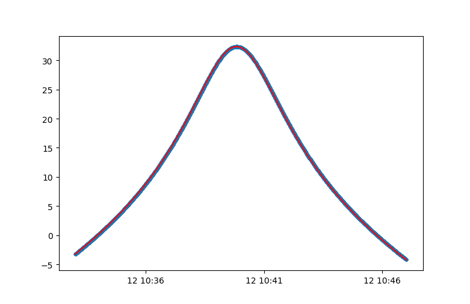
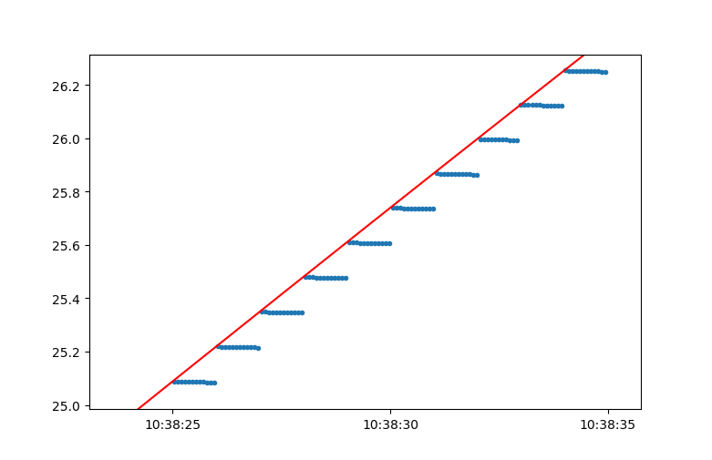
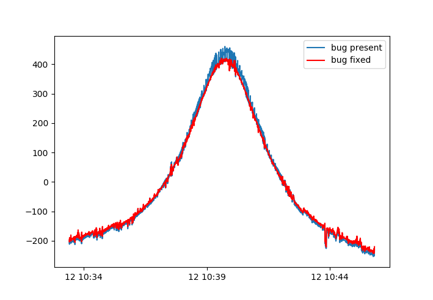
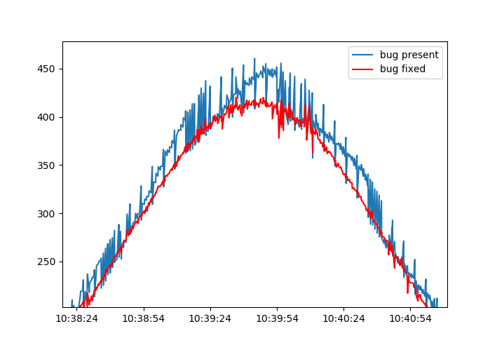

Developer Guide
***************

This is the developer guide.

Writing Code
============

Code should conform to :pep:`8`.

A Tale of Caution
-----------------

Writing any type of software can be difficult. 
Here is an example of how big of an impact a small bug can have.

Ever since we started analyzing our data we had been seing a strange zig-zag pattern.
We couldn't understand what was causing this, so we assumed it was a systemic error in our system.
After several years we finally stumbled upon the cause while working on something unrelated.
It turned out to be a change to an ``int`` where it should have been a ``float``::

    time_nums = [int(t) for t in time.strftime('%Y %m %d %H %M %S.%f').split()]
    pos, vel = super().propagate(*time_nums, **kwargs)
    
These two lines take a datetime string and turn it into a list of numbers, i.e. year, month, day, etc.
This list is then fed into the TLE propagator. 
However, the seconds included microseconds as well, and these microseconds were cut off when converting to an integer.
This meant that for any two timestamps, if only the microseconds were different, then the propagator would return the same state vector.

This can bee seen in these figures where elevation is plotted against time. 
In the first figure it looks like the curve is smooth, but when zooming in it is clear that the result is instead a step function.

The bug was fixed simply by changin the integer conversion to a float conversions::

    time_nums = [float(t) for t in time.strftime('%Y %m %d %H %M %S.%f').split()]
    
    
And in the following figures we can see the result of fixing this bug.

    

Writing Documentation
=====================

Besides pip installing the packages from requirements.txt it is also necessary to install sphinx itself. On linux use apt to install python3-sphinx.

Manually create a _static folder in the docs folder. 

Install graphviz if inheritance diagrams are needed.

Run the following command to build the documentation in the correct build directory::

    sudo sphinx-build -b html . /var/www/html/docs-doptrack

Setting Up Website
==================

The DopTrack website currently consists of two parts: 
doptrack.tudelft.nl which holds the main website,
and app.doptrack.tudelft.nl which holds the DopTrack app.

The server uses the apache2 web server to deliver these website.
The documentation for Apache2 configuration for Ubuntu can be found at::

    /usr/share/doc/apache2/README.Debian
    

On Ubuntu the apache2 script does not give access to start, stop, restart, and status commands for the web server.
Instead use the following script::

    /etc/init.d/apache2
    

Setting up VirtualHosts
-----------------------

The apache2 web server uses name-based virtual hosts to redirect incoming requests to either the main site or the app.
These virtual hosts are set up in the hosts file.

show active virtual hosts::
    
    apache2ctl -S

    
Inspecting errors
-----------------

If the deployment of the website does not work the first place to look is in the logs.

The virtual host access log shows what requests are being sent to the web server.
Listen to this log by running the following command in shell::

    tail -f /var/log/apache2/other_vhosts_access.log

In case something goes wrong with the Flask server used for the app any errors, 
including Python errors, are sent to the error log::

    tail -f /var/log/apache2/error.log
    

